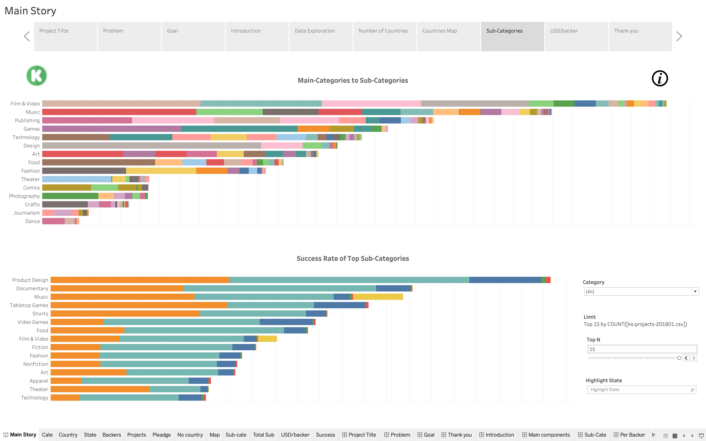

# Kickstarter Analysis
> Project to analyze historical data of Kickstarter projects using Tableau   

## Table of Contents
* [General Info](#general-information)
* [Technologies Used](#technologies-used)
* [Project Presentation](#project-presentation)
* [Screenshots](#screenshots)
* [Setup and Usage](#setup-and-usage)
* [Project Status](#project-status)
* [Room for Improvement](#room-for-improvement)
* [Acknowledgements](#acknowledgements)
* [Contact](#contact)
<!-- * [License](#license) -->

## General Information
- Built interactive dashboards and created stories to visualize and analyze Kickstarter projects data using Tableau
- Included data presentation for project proposal and highlight

## Technologies Used
- Tableau - version 2020.4.1

## Project Presentation
- Problem
- Goal
- Introduction
- Data Exploration
- Number of Countries
- Countries map
- Sub-Caregories
- USD/backer

## Screenshots

## Setup and Usage
The code was generated using Tableau, and it requires Tableau - version 2020.4.1. To try out this project, download Tableau Desktop application and try this github repo

## Project Status
Project is: _finished_ and _opened_ for improvement

## Room for Improvement
Room for improvement:
- Improvement by working with more recent data about Kickstarter projects to find newest trends
- Create more insightful dashboards/stories 

To do:
- Find more recent data from Web API Scraper and Kaggle  
- Make more graphs to generate more dashboards and stories in order to find more useful insights

## Acknowledgements
This project was inspired by 2 Professors at University of Houston and many Data Scientists working at the Data Analysis and Intelligent Systems Lab

## Contact
Created by Anh Nguyen - [aqnguy30](https://github.com/aqnguy30) - quocanh191997@gmail.com - feel free to contact me! 

## License
This project is open source and available under the [GNU General Public License v3.0](./LICENSE) 
